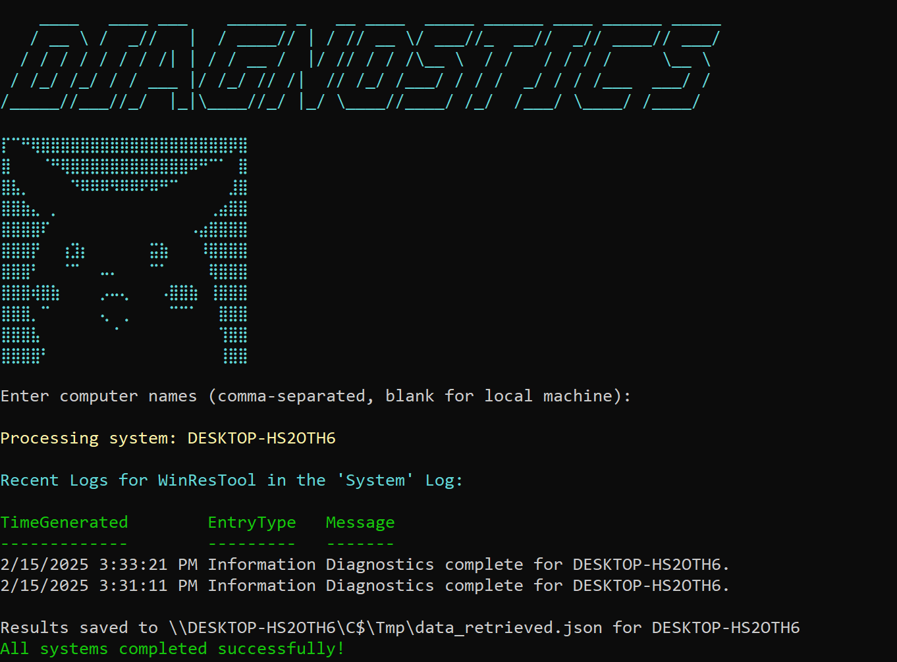
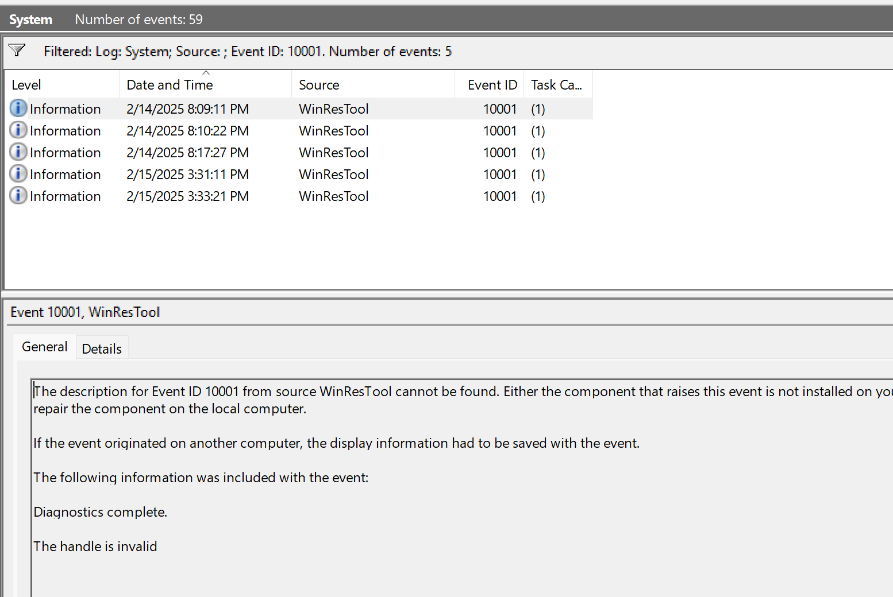

# Angeles System Diagnostics Tool

## Overview
The **Angeles System Diagnostics Tool** consists of a PowerShell module (`Angeles_Enum.psm1`) and a startup script (`Angeles_StartUp.ps1`) designed to retrieve and analyze system details across multiple machines. This tool collects system information such as OS details, storage usage, installed applications, process details, user accounts, environment variables, and network configuration.

## Features
- Retrieves detailed OS and system information.
- Gathers storage usage statistics.
- Lists installed Microsoft and Windows-related applications.
- Enumerates running processes along with OS version details.
- Identifies user accounts and administrator privileges.
- Extracts relevant environment variables.
- Collects network adapter details, including IP and MAC addresses.
- Runs parallel diagnostics across multiple systems and saves the results in JSON format.
- Logs events in the Windows Event Log upon completion.

## File Structure
```
📁 Angeles_Tool
 ├── Angeles_StartUp.ps1  # PowerShell script to initiate system enumeration
 ├── Angeles_Enum.psm1    # PowerShell module containing diagnostic functions
 ├── daArt.txt            # Optional ASCII art displayed at script startup
```

## Prerequisites
- Windows PowerShell 5.1 or later.
- Administrative privileges for retrieving system information and creating event logs.
- Network connectivity if running diagnostics on remote systems.

## Installation
1. **Download the script and module.**
2. **Ensure both files (`Angeles_StartUp.ps1` and `Angeles_Enum.psm1`) are in the same directory.**
3. **Optional:** Place an ASCII art file (`daArt.txt`) in the same directory to display a banner at startup.

## Usage
### Running the Startup Script
To execute the startup script, open PowerShell as an administrator and run:
```powershell
.\Angeles_StartUp.ps1
```
### Selecting Target Machines
- When prompted, enter a **comma-separated list** of computer names.
- If left blank, the script defaults to analyzing the local machine.

### Output Location
Results are saved in:
```
\\<ComputerName>\C$\Tmp\data_retrieved.json
```


## Module Functions (`Angeles_Enum.psm1`)
| Function Name              | Description |
|----------------------------|-------------|
| `Get-OSDetails`           | Retrieves the OS name, version, and system type. |
| `Get-StorageDetails`      | Provides disk usage details (drive, total size, free space). |
| `Get-InstalledApps`       | Lists installed Microsoft and Windows-related applications. |
| `Get-ProcessDetails`      | Enumerates running processes along with OS details. |
| `Get-UserDetails`         | Extracts local user accounts and administrator memberships. |
| `Get-EnvironmentVariables` | Retrieves specific environment variables (e.g., `Path`, `PSModulePath`). |
| `Get-NetworkInfo`         | Lists network adapters with IP and MAC addresses. |

## Logging & Event Tracking
- The script logs events under the **Windows System Event Log** with the source `WinResTool`.
- Upon successful execution, it writes a completion event:
  ```
  Event ID: 10001
  Message: Diagnostics complete for <ComputerName>.
  ```
  

- The last 30 minutes of logs related to this tool are displayed after execution.

## Troubleshooting
1. **Missing Permissions:** Ensure PowerShell is running as an administrator.
2. **Module Not Found:** Ensure `Angeles_Enum.psm1` is in the same directory as the script.
3. **No Output File:** Verify network access to the target machine and check `C$\Tmp\` for saved results.
4. **Event Log Issues:** Run PowerShell as admin and manually create the event source using:
   ```powershell
   New-EventLog -LogName "System" -Source "WinResTool"
   ```
